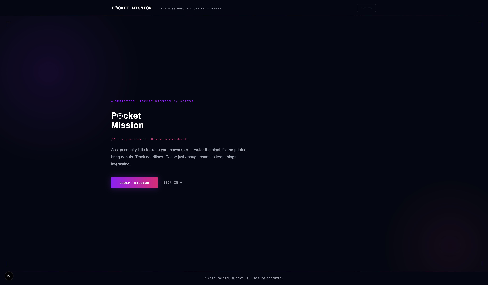
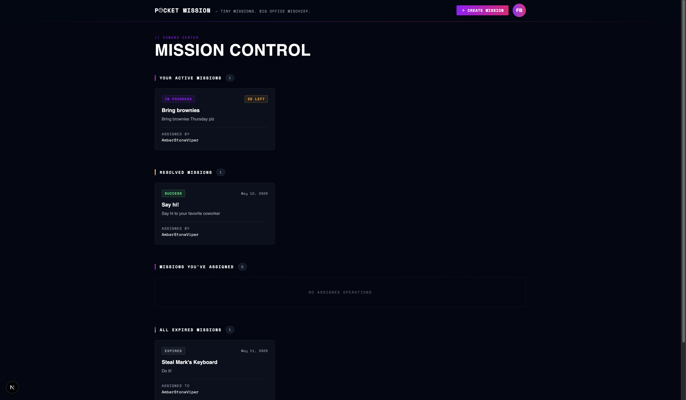

# Pocket Mission

A mission management app built while working through the [Claude Code Masterclass](https://www.udemy.com/course/claude-code-master-class/) on Udemy.

This project started as a fork of [iamshaunjp/Claude-Code-Masterclass](https://github.com/iamshaunjp/Claude-Code-Masterclass) — the official starter for the course — and evolved into a full feature build using Claude Code as the primary development tool.

**Live:** [claude-code-masterclass-mocha.vercel.app](https://claude-code-masterclass-mocha.vercel.app/)

## Screenshots





## Stack

- Next.js 16, React 19, TypeScript
- Tailwind CSS v4 with CSS Modules
- Firebase Auth + Firestore

## Getting Started

Copy the environment template and fill in your Firebase credentials:

```bash
cp .env.example .env.local
```

Install dependencies and start the dev server:

```bash
npm install
npm run dev
```

Open [http://localhost:3000](http://localhost:3000) to view the app.
